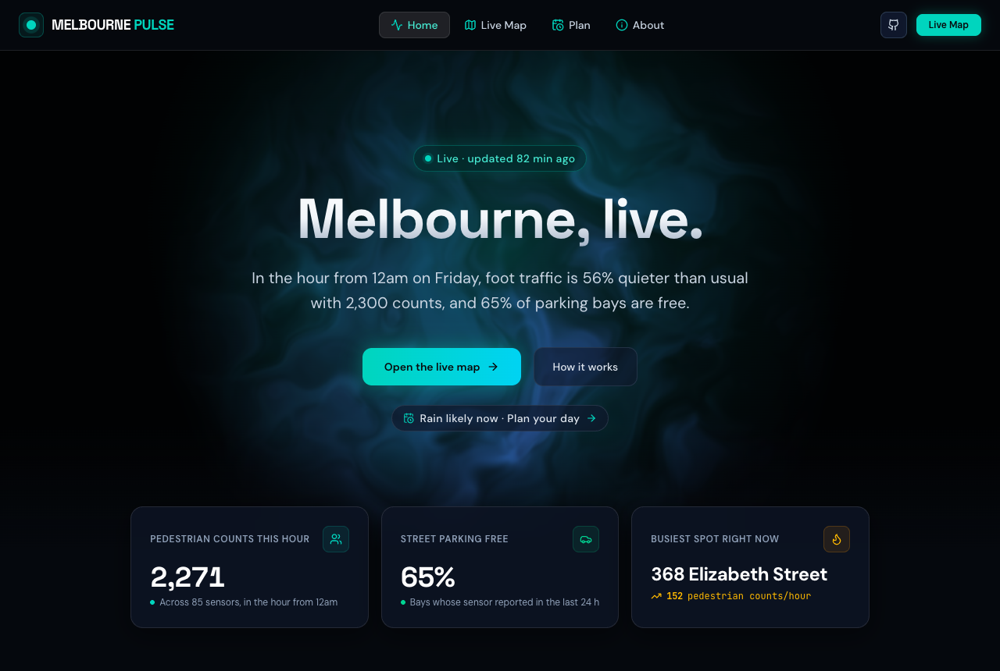
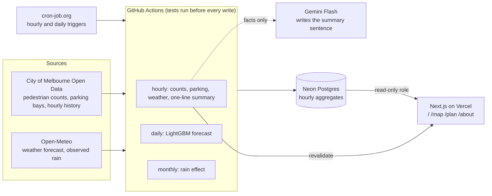

# Melbourne Pulse

**Live:** [melbourne-pulse-au.vercel.app](https://melbourne-pulse-au.vercel.app)

How busy is Melbourne's CBD right now, how busy will it be over the next 36
hours, and when should you go? A live map, a machine-learning forecast and a
planner, built on open city data and run entirely on free tiers.




## What it does

- **Live counts.** Every hour it reads the City of Melbourne's pedestrian
  sensors and parking bay sensors, and shows the counts on a
  [map](https://melbourne-pulse-au.vercel.app/map) next to what is typical for
  that hour and weekday.
- **36-hour forecast.** A LightGBM model forecasts pedestrian counts for every
  sensor, using each sensor's history, the calendar and the weather forecast.
- **Plan page.** [Plan](https://melbourne-pulse-au.vercel.app/plan) turns the
  forecast and the chance of rain into an answer: the best two hours for the
  busiest dry spell, the most foot traffic, or the quietest time, for the whole
  CBD or any one sensor.

## Results

- **The forecast beats the simple rule.** On 132,696 sensor-hours the model
  had never seen (8 weeks, 5 Aug to 29 Sep 2026), its average error was 53.2
  pedestrian counts an hour, against 61.7 for "typical" (the median of the same
  hour over the last 8 weeks). That is 14% more accurate.
- **The weather forecast helps, most of all when it rains.** In rainy hours the
  error was 69.2, against 81.7 for the same model without weather.
- **The gain is from the weather, not from extra inputs.** As a placebo, the
  model was retrained with the weather moved 14 days, so every hour got the
  wrong forecast. It did no better than the model without weather (55.7
  overall, 81.5 in rainy hours).
- **Rain means about 18.5% fewer pedestrian counts.** Measured on 2 Oct 2026
  over the 12 months from 1 Oct 2025 to 30 Sep 2026: −18.5% in a wet hour (95%
  interval −21.8% to −14.9%, 868 wet hours), and −29.4% in heavy rain. 99 of
  102 sensors have a reliable estimate of their own. This is recalculated
  monthly; the [Plan page](https://melbourne-pulse-au.vercel.app/plan?evidence=1)
  shows the current figures. It explains the forecast and is never applied to it.

How each number was tested: [model/REPORT.md](model/REPORT.md).

## Architecture



## Tech stack

| Part | Built with |
|---|---|
| Pipeline (`pipeline/`) | Python, `requests`, `psycopg`, NumPy, pytest |
| Model (`model/`) | Python, LightGBM, pandas, matplotlib |
| Website (`web/`) | Next.js 16 (App Router), React 19, TypeScript, Tailwind, Recharts, Leaflet + MapLibre GL |
| Database | Neon Postgres (serverless), a read-only role for the website |
| Scheduling | GitHub Actions, started by cron-job.org |
| Data | City of Melbourne Open Data (CC BY), Open-Meteo (CC BY 4.0), OpenFreeMap basemap |

## Runs on $0

Everything stays inside free tiers, with room to spare:

| Service | Used | Free limit |
|---|---|---|
| Neon storage | about 40 MB at 90 days | 0.5 GB |
| Neon compute | about 18 CU-hours a month | 100 CU-hours |
| GitHub Actions | about 730 minutes a month | unlimited on a public repo |
| Vercel, cron-job.org, Open-Meteo, Gemini Flash | a few dozen requests an hour at most | well under each free limit |

The working is in [Free-tier budget](#free-tier-budget) below.

## Honest limitations

- **Sensors count passes, not people.** One person walking past three sensors
  is counted three times, so the numbers are pedestrian counts, not visitors.
  They are useful for comparing hours and places, not for headcounts.
- **One test window.** The model was scored on one 8-week window, which had 125
  wet hours. The rainy-hour results rest on a small number of rainy spells and
  should be re-checked as more rain is recorded.
- **Unknown events are invisible.** The model knows public and school holidays
  but not concerts, protests or match days.
- **Free tiers have conditions.** Open-Meteo's free API and Vercel's Hobby plan
  are for non-commercial use, and Gemini's free tier has low rate limits. A
  commercial version would need paid plans.

## More

- [model/REPORT.md](model/REPORT.md): how the forecast was tested, with the chart and every comparison.
- [docs/plan-api.md](docs/plan-api.md): the JSON behind the Plan page, with real examples.
- [docs/MAINTENANCE.md](docs/MAINTENANCE.md): yearly upkeep, where every setting lives, what to check when something looks stale.
- [docs/data.md](docs/data.md): the data sources, field by field, and their quirks.
- [docs/scheduling.md](docs/scheduling.md): why an outside cron service starts the jobs.

## How it works


- **`pipeline/`** (Python). `fetch.py` sums the per-minute pedestrian feed into
  hourly counts and the parking feed into CBD-wide totals, then keeps a slim
  "latest" snapshot for the map. `weather_forecast.py` stores the next 48 hours
  of Open-Meteo forecast. `summary.py` sends a few stats (never raw data) to
  Gemini Flash for a one-sentence summary, checks every number, time and rain
  claim in the reply against the data, and falls back to a template if anything
  is off. `feed_quality.py` flags hours when most sensors read under half their
  typical at once: the site then shows a notice instead of a comparison, and
  the model leaves those hours out. A day later `audit.py --resolve` checks
  each flagged hour against the city's published totals and marks it as real
  (unflagged) or as a fault in the live feed (kept out of the site's
  comparisons; the model uses the city's final figures for it). `audit.py` recomputes the homepage numbers straight from the city's
  API to check them. `seed_history.py` backfills 8 weeks of history once, so "busier
  than usual" works from day one.
- **`model/`** (Python, LightGBM). `train.py` learns from two years of hourly
  counts plus past weather forecasts (Open-Meteo, free, no key) and writes
  [REPORT.md](model/REPORT.md). `predict.py` runs daily at
  ~4am Melbourne time and writes the next 36 hours per sensor, plus the
  "typical" baseline, into `forecasts`. 36 rather than 24, so there are always
  at least 24 hours ahead to show. If the weather forecast can't be fetched,
  that run uses a second model without weather instead of failing.
- **`web/`** (Next.js 16, App Router, Tailwind, Leaflet + MapLibre GL, Recharts). The landing
  page, `/map` and `/about` are server components that read Neon over HTTP as
  a read-only role. Pages are cached for an hour and refreshed on demand right
  after each ingest. Leaflet loads client-side only.
- **Plan page (`/plan`).** Picks a time to be in the CBD from the forecast and
  the chance of rain, for the whole CBD or one sensor. Its data comes from
  three small endpoints ([docs/plan-api.md](docs/plan-api.md)) that answer from
  one cached read of the database. `pipeline/weather_forecast.py` (hourly)
  stores the Open-Meteo forecast and `pipeline/rain_effect.py` (monthly)
  measures how much rain changes pedestrian counts, which the page uses to
  explain the forecast, never to adjust it.
- **`docs/data.md`**: the real API fields, their quirks, and how each was
  checked.
- **Scheduling:** GitHub's own cron skips runs on busy hours, so cron-job.org
  starts the hourly job and GitHub's schedule is a backup that stands down when
  it isn't needed. Each run re-reads 24 hours, so a missed run heals on the next
  one. See [docs/scheduling.md](docs/scheduling.md).
- **Maintenance:** yearly token renewal, where every setting lives, a quick
  health check and what to do if a key leaks. See [docs/MAINTENANCE.md](docs/MAINTENANCE.md).

## Forecast results

Tested on the last 8 weeks of data, which the model never saw during training.
Lower is better.

| Method | Average error (pedestrian counts/hour) | Average % error |
|---|---:|---:|
| Same hour last week | 71.5 | 31.6% |
| Typical (8-week median, the app's baseline) | 61.7 | 25.7% |
| LightGBM without weather | 55.3 | 23.6% |
| **LightGBM with the weather forecast** | **53.2** | **22.3%** |

Every history input is known at least a week in advance, and weather inputs are
forecasts issued a day ahead, never observed weather, so nothing leaks from
the future. [Full report, with chart and method](model/REPORT.md).

## Free-tier budget

The limits that matter are **Neon Free: 0.5 GB storage and 100 CU-hours a
month**, with compute scaling to zero after 5 idle minutes. The storage figures
below were measured on Postgres 16 with real data, not guessed.

### Storage: about 40 MB at 90 days (about 8% of 0.5 GB)

Rows older than 90 days are deleted every hour, so storage stops growing at day 90.
On Neon at launch, with 8 weeks seeded (133,498 pedestrian rows), the database
measured **20 MB** (3.9% of 0.5 GB).

| Table | Working | Size at 90 days |
|---|---|---:|
| `pedestrian_hourly` | Measured: 126,454 rows (8-week seed) = 14.4 MB with indexes, so **114 B/row**. 99 live sensors × 24 h × 90 days = 213,840 rows → 24 MB. If all 134 sensors report: 289,440 rows → 33 MB. | 24–33 MB |
| `parking_hourly` | 24 × 90 = 2,160 rows × ~100 B | 0.2 MB |
| `latest` | 4 rows. The 6,324-bay parking payload is 575 kB of JSON but 100 kB once Postgres compresses it. Measured 216 kB after vacuum. | 0.2 MB |
| `forecasts` | 99 sensors × 36 h, plus 2 days kept | 0.5 MB |
| `weather_forecast`, `rain_effect` | 48 forecast hours plus 2 days kept; about 110 rain-effect rows | under 0.1 MB |
| `feed_quality` | one small row an hour: 8,760 a year × ~60 B | 0.5 MB a year |
| Postgres system catalogs | Measured size of an empty database | ~7.3 MB |
| **Total** | | **32–41 MB** |

At 60 days the total is about 24–30 MB (142,560–192,960 pedestrian rows). Each
hourly run also writes **160 kB** of change history (WAL, measured), about
3.8 MB/day, which is small next to Neon's short restore window.

### Compute: about 18 CU-hours a month (worst case about 35, out of 100)

Neon bills compute for as long as the database is awake. Each wake costs the
time spent querying plus 5 idle minutes before it suspends. Compute is fixed at
the minimum size, **0.25 CU**.

| What wakes the database | Working | CU-h/month |
|---|---|---:|
| Hourly ingest | fetch and summary take about 5 s of DB work, plus the page warm-up a few seconds later, so about 5.5 min awake per run. 24 × 30.4 = 730 runs × 5.5/60 h × 0.25 CU | 16.7 |
| Daily forecast | 30.4 runs × ~6/60 h × 0.25 CU | 0.8 |
| Monthly rain effect | 1 run × ~6/60 h × 0.25 CU | ~0 |
| Website visitors | Pages are cached (`revalidate = 3600`) and re-rendered by the hourly Action while the DB is already awake. Visitors hit the cache. | ~0 |
| **Typical total** | | **~17.5** |
| Worst case: GitHub delays the hourly cron past the page's 1-hour cache and a visitor arrives in that gap, every hour | + one extra 5-minute wake per hour = +16.7 | **~34** |

This only holds if the site never queries the database per click. The sensor
chart data therefore ships inside the cached page instead of coming from an API
call.

### The other services

- **GitHub Actions:** free and unlimited on a public repo. The hourly job takes
  about 1 min, so about 730 min/month, plus a few seconds an hour for the backup
  schedule's check (which never touches the database).
- **cron-job.org:** free; one request an hour, plus one a day for the forecast.
- **Open-Meteo:** free, no key. About 25 forecast requests a day and one
  history request a month, against a free limit of 10,000 a day.
- **Gemini Flash (free API):** 24 short calls a day, well under the free daily
  request limit. Pinned to `gemini-3.8-flash`, falling back to
  `gemini-3.5-flash`. If both fail, or a reply's numbers don't match the real
  stats, a template sentence is used.
- **Vercel Hobby:** one static page per hour plus about 24 calls a day to
  `/api/revalidate`.
- **Map tiles:** [OpenFreeMap](https://openfreemap.org)'s dark style (free, no API key, no
  account), drawn by MapLibre GL inside Leaflet via `@maplibre/maplibre-gl-leaflet`.

## Setup

### 1. Database (Neon, no card needed)

1. Sign up at [neon.tech](https://neon.tech) and create a project in
   **AWS Asia Pacific (Sydney)**.
2. **SQL Editor**: paste [pipeline/schema.sql](pipeline/schema.sql) and run it.
   Then give the read-only role a password (don't commit it):
   ```sql
   alter role web_reader password '<output of: openssl rand -hex 32>';
   ```
3. **Branch → Compute → Edit**: set compute size to 0.25 CU (min and max) and
   leave scale-to-zero at 5 minutes.
4. **Connect**: turn on *Connection pooling* and copy two connection strings:
   - as the owner role → `DATABASE_URL`
   - as `web_reader` → `DATABASE_URL_READONLY`
5. Backfill 8 weeks of history once:
   ```bash
   python -m venv .venv && .venv/bin/pip install -r pipeline/requirements-dev.txt
   cd pipeline && DATABASE_URL='…' ../.venv/bin/python seed_history.py
   ```

### 2. GitHub (public repo)

**Settings → Secrets and variables → Actions**

| Kind | Name | Value |
|---|---|---|
| Secret | `DATABASE_URL` | Neon pooled URL, owner role |
| Secret | `GEMINI_API_KEY` | from [aistudio.google.com/apikey](https://aistudio.google.com/apikey) |
| Secret | `REVALIDATE_SECRET` | `openssl rand -hex 32` (same value as in Vercel) |
| Variable | `SITE_URL` | your Vercel URL, e.g. `https://melbourne-pulse-au.vercel.app` (add after deploying; until then the revalidate step is skipped) |

Then set up the hourly trigger on cron-job.org: [docs/scheduling.md](docs/scheduling.md).

### 3. Website (Vercel Hobby)

1. **Add New → Project**, import this GitHub repo, and set **Root Directory**
   to `web`. The framework preset is detected as Next.js.
2. **Environment Variables** (Production):
   - `DATABASE_URL_READONLY`: Neon pooled URL for `web_reader`
   - `REVALIDATE_SECRET`: the same value as the GitHub secret
   - `NEXT_PUBLIC_SITE_URL`: your Vercel URL (used for share-card links)
3. **Deploy**, then add the URL as the `SITE_URL` variable in GitHub.

## Development

```bash
# pipeline
cd pipeline
../.venv/bin/python -m pytest -q          # unit tests on saved real API responses
../.venv/bin/python fetch.py --dry-run    # live feeds, no database
../.venv/bin/python summary.py --dry-run
../.venv/bin/python audit.py                # needs DATABASE_URL; checks the homepage numbers against the city's API
../.venv/bin/python seed_history.py --dry-run

# model
cd ../model
../.venv/bin/pip install -r requirements-dev.txt
../.venv/bin/python -m pytest -q          # includes a no-future-leakage test
DATABASE_URL='…' ../.venv/bin/python train.py              # ~10 min; rewrites model*.txt.gz, REPORT.md, chart.png
                                                          # (needs the database to skip flagged hours; --no-quality-flags to train without)
../.venv/bin/python predict.py --dry-run

# web
cd ../web && cp .env.example .env.local && npm install && npm run dev
```

## Data

City of Melbourne Open Data, CC BY. See [docs/data.md](docs/data.md).
Weather: [Open-Meteo](https://open-meteo.com), CC BY 4.0 (forecast and historical weather APIs).
Basemap: [OpenFreeMap](https://openfreemap.org), © [OpenMapTiles](https://www.openmaptiles.org/),
data © [OpenStreetMap](https://www.openstreetmap.org/copyright) contributors.

## License

Code is [MIT](LICENSE). Data stays under the City of Melbourne's CC BY licence.
