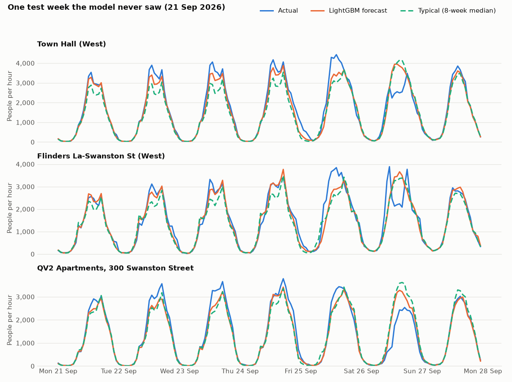

# Forecast model report

*Generated by `model/train.py` on 2026-10-02. Numbers come from `metrics.json`.*

## The question

Melbourne Pulse shows how busy each pedestrian sensor is compared with a
**typical** level: the median count for the same hour and weekday over the last
8 weeks. Can a machine-learning model predict the **next 24 hours** better than
that simple rule? If it can't, a forecast adds nothing and shouldn't be on the
site.

## The answer

**LightGBM beats the app's own baseline.** Its average error is **53.2 people per hour**, against 61.7 for the 8-week typical (14% lower) and 71.5 for "same as last week" (26% lower). It is more accurate than typical in every one of the 13 daytime hours (7am to 8pm), with the biggest gain at 17:00 (110 down to 88 people).

| Method (test set: 2026-08-05 to 2026-09-29) | Average error (MAE, people/hour) | Average % error (MAPE) |
|---|---:|---:|
| Seasonal naive (same hour last week) | 71.5 | 31.6% |
| Typical (8-week median, the app's baseline) | 61.7 | 25.7% |
| LightGBM | 53.2 | 22.3% |

*Lower is better. MAE is the average gap between the prediction and the real
count. MAPE is the same gap as a percentage of the real count; it only counts
hours with at least 10 people, because a percentage of almost zero is
meaningless.*

The chart shows the three busiest sensors (**Town Hall (West)**, **Flinders La-Swanston St (West)** and **QV2 Apartments, 300 Swanston Street**) over one week of
the test period. The model never saw these weeks during training. This week includes a public holiday: Friday before the AFL Grand Final (Fri 25 Sep). The model knows the day is a holiday, but most holidays make the CBD quieter, so it can't know when an event (like a parade or a big match) makes it busier or pulls people elsewhere. That is where the biggest misses are.

## Does weather help?

A separate study of the same sensors (*Rain or Shine*, 2025) found about 18%
fewer pedestrians in a wet hour and about 30% fewer in heavy rain. So the
model was given the weather **forecast** for each hour (rain, rain over the
last three hours, a wet/dry flag, temperature and wind, from Open-Meteo) and
retrained with the same settings, the same split and the same test hours.

| Method | All test hours (MAE) | Wet test hours only (MAE) |
|---|---:|---:|
| Typical (8-week median) | 61.7 | 82.6 |
| BASE: LightGBM without weather | 55.3 | 81.7 |
| BASE + WEATHER, forecast issued just before the hour | 53.4 | 68.0 |
| BASE + WEATHER, forecast issued 24 h before the hour | 53.2 | 69.2 |

*"BASE" is the best model without weather (base + extra in the
Attempts table). Wet hours are the 12,318
test sensor-hours (125 of 1,344 hours) where the
freshest forecast had at least 0.2 mm of rain.*

**Decision: ship BASE + WEATHER.** It beats BASE on overall test error with both sets of forecasts (53.4 and 53.2 against 55.3). The shipped model is the one trained on day-old forecasts, so the daily job never relies on forecasts fresher than it was tested with.

Why: rain does thin the crowds and the model picks that up, but the gain is limited by the weather forecast itself: of the 125 wet hours in the test weeks, the forecast made a day earlier called only 65 wet.

The two weather rows differ only in how old the forecast is. Observed weather
was never used, because the model won't have it when it runs. Open-Meteo's
Historical Forecast API joins up the first few hours of every past forecast
run, so its values were issued just before the hour they describe. The daily
job runs only once a day, at about 4am, and the site shows each of its
predictions for up to 24 hours, so the weather forecast behind a prediction
can be up to a day old. The last row uses the forecast issued 24 hours before
each hour (Open-Meteo's Previous Runs API), which is as old as it gets. A
model that only won on the fresher row would look better in this test than it
would be on the site.

## How it was tested fairly

- **Data:** two years of hourly counts from 103 City of Melbourne
  sensors (the *Pedestrian Counting System, monthly counts per hour* dataset,
  CC BY). Hours with nobody walking past aren't published, so they were
  filled in as 0. Days when a sensor sent nothing at all were treated as
  *sensor down*, not as a quiet day.
- **Split by time, never shuffled.** The model learned from
  2024-10-08 to 2026-06-09. The next 8 weeks
  (2026-06-10 to 2026-08-04) were used to pick
  settings, and the final 8 weeks were used **once** for the scores above.
- **No peeking at the future.** The site shows forecasts up to 36 hours
  ahead, so the model may only use information that exists well before the
  hour it predicts. Every history-based input looks back at least a full week,
  for example "same hour last week". An automated test deletes the most recent
  7 days of data and checks that no input changes. Weather inputs are
  forecasts, never observed weather (see "Does weather help?").
- **Same questions for everyone.** All three methods were scored on the same
  132,696 sensor-hours, the ones where every method
  could make a prediction.
- **Daylight saving handled.** "Same hour last week" means the same *local*
  hour, so 9am is compared with 9am when the clocks change.

## What the model pays attention to

| # | Input | Share of the model's learning (gain) |
|---|---|---:|
| 1 | Median of the same hour over the last 8 weeks | 40% |
| 2 | Average of the same hour over the last 4 weeks | 36% |
| 3 | Which sensor (each location has its own pattern) | 13% |
| 4 | Sensor's whole-day total on the same day last week | 2% |
| 5 | Hour of the day | 2% |
| 6 | How many of the last 8 weeks the sensor was working | 1% |
| 7 | Count at the same hour last week | 1% |
| 8 | Month (season) | 1% |

## Attempts

| Feature set | Typical MAE | LightGBM MAE | Settings (chosen on validation) |
|---|---:|---:|---|
| base (12 features) | 61.7 | 57.3 | l1, 1500 trees |
| base + extra (14 features) | 61.7 | 55.3 | l1, 1487 trees |
| base + extra + weather (issued just before the hour) (19 features) | 61.7 | 53.4 | l1, 655 trees |
| base + extra + weather (issued 24 h before the hour) (19 features) | 61.7 | 53.2 | l1, 1431 trees |

"Extra" adds Victorian **school holidays** and a **sensor-was-down** count.
"Weather" adds the five weather-forecast inputs described above.
The loss function and the number of trees were chosen on the validation weeks
only. Tree count was capped at 1,500 to keep the model file small; the l1 runs
stopped at or near that cap, so a larger model might gain a little more.

## Error by hour of day (test set)

Show the 24-hour table

| Hour | Naive MAE | Typical MAE | LightGBM MAE | Naive MAPE | Typical MAPE | LightGBM MAPE |
|---|---:|---:|---:|---:|---:|---:|
| 00:00 | 21 | 18 | 16 | 36% | 30% | 28% |
| 01:00 | 13 | 12 | 11 | 36% | 31% | 29% |
| 02:00 | 10 | 8 | 7 | 37% | 30% | 28% |
| 03:00 | 8 | 6 | 6 | 41% | 32% | 30% |
| 04:00 | 6 | 5 | 5 | 37% | 31% | 28% |
| 05:00 | 7 | 6 | 6 | 32% | 26% | 25% |
| 06:00 | 18 | 19 | 15 | 31% | 31% | 24% |
| 07:00 | 37 | 34 | 28 | 29% | 24% | 19% |
| 08:00 | 66 | 59 | 52 | 26% | 21% | 17% |
| 09:00 | 68 | 57 | 54 | 25% | 19% | 18% |
| 10:00 | 84 | 71 | 65 | 26% | 20% | 19% |
| 11:00 | 104 | 86 | 79 | 26% | 20% | 19% |
| 12:00 | 142 | 119 | 102 | 30% | 24% | 20% |
| 13:00 | 142 | 117 | 99 | 27% | 21% | 18% |
| 14:00 | 151 | 124 | 106 | 32% | 25% | 22% |
| 15:00 | 128 | 108 | 90 | 27% | 21% | 18% |
| 16:00 | 112 | 101 | 81 | 22% | 18% | 14% |
| 17:00 | 112 | 110 | 88 | 20% | 18% | 14% |
| 18:00 | 115 | 113 | 96 | 29% | 28% | 23% |
| 19:00 | 92 | 80 | 68 | 34% | 28% | 24% |
| 20:00 | 89 | 72 | 61 | 36% | 31% | 27% |
| 21:00 | 74 | 59 | 50 | 37% | 32% | 28% |
| 22:00 | 73 | 57 | 52 | 60% | 38% | 32% |
| 23:00 | 46 | 41 | 39 | 43% | 34% | 32% |

## Limits

- The model knows about holidays but not one-off events such as concerts,
  protests or big sports days, so those hours will be off.
- A sensor that has just been installed or repaired has little history, so
  its forecast leans on the general pattern for that hour and day.
- Weather comes from a free forecast service (Open-Meteo). If it can't be
  reached, that day's run uses the model without weather (`model_base.txt.gz`),
  so those forecasts are as accurate as BASE, not better.
- The shipped model was retrained on all the data using the settings chosen
  above. It is 3.0 MB (`model.txt.gz`) and is rebuilt
  by running `python model/train.py`.
